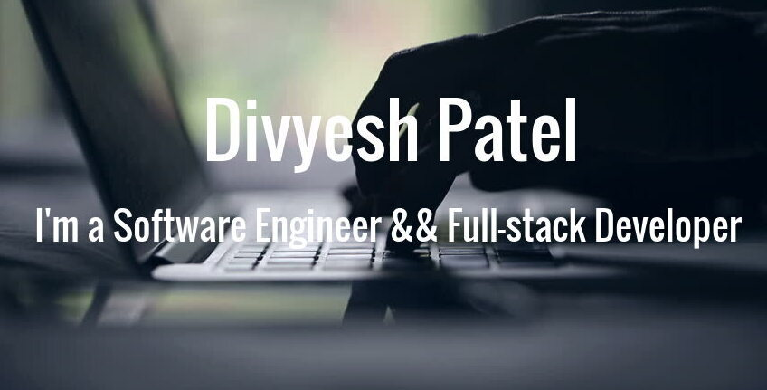

## Hi there, I'm [Divyesh](https://divyesh-55183.web.app/) 👋 :man:‍💻

<!-- -->

I'm a software engineer & full-stack developer who is passionate about making open-source more accessible, creating technology to elevate people, and building community. Some technologies I enjoy working with include ReactJS, Ruby, Python, Flutter, HTML, CSS.

- 🔭 I’m currently working as Freelance Developer
- 🌱 I’m currently learning Ruby on Rails.
- 👯 I’m looking to collaborate with other developers.
- ⚡ Fun fact: I love playing cricket && football
- 💻 I'm looking for a new opportunies

### Github Stats

 

 

## Find me around the web :earth_africa:: 
   - [Twitter](https://twitter.com/div_685)
   - [LinkedIn](https://www.linkedin.com/in/divyesh-daxa-patel/)
 
